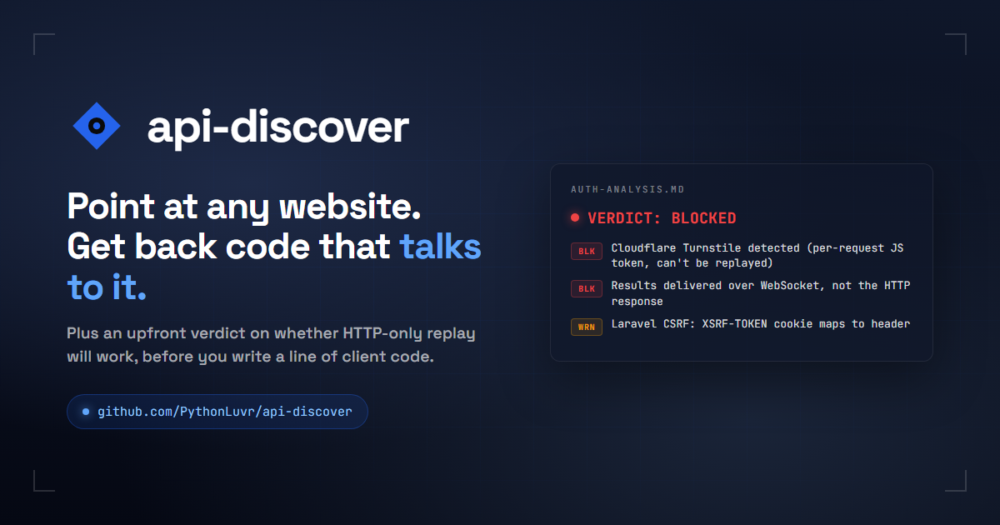

<p align="center">
  
</p>

# api-discover

**Point at any website. Get back code that talks to it like an API.**

Plenty of useful web tools have no public API. The only way to use them programmatically is either to click around by hand or write a scraper from scratch. `api-discover` replaces both. It watches one of your real browser sessions, captures every network call the site makes, and writes a typed client you can call from your own code.

It also tells you upfront if the site uses bot protections (CAPTCHAs, request signing, results delivered over WebSocket) that would block your code from running outside a real browser. That last part is the unique piece. Most tools dump captures and let you discover at 2 AM that the endpoint you wanted is gated.

For developers: emits OpenAPI 3.1, a zero-dependency JavaScript client, a visual report with `curl` examples, and a 15-rule auth-feasibility analysis (Turnstile, CSRF families, SSO chains, etc.).

## Quickstart

```bash
git clone https://github.com/PythonLuvr/api-discover.git
cd api-discover
./install.sh                                # or .\install.ps1 on Windows

# Launch a CDP-attached browser (one-time per session):
api-discover doctor                         # prints the exact command for your platform

# Capture a flow:
api-discover capture https://httpbin.org/anything -o ./out/demo -d 30

# Read the verdict:
cat ./out/demo/auth-analysis.md
```

## What you get

```
out/run-1/
├── api-spec/
│   ├── openapi.yaml          # OpenAPI 3.1
│   ├── client.mjs            # zero-dep fetch SDK
│   ├── report.html           # visual report
│   └── report.md             # same content, markdown
├── auth-analysis.md          # replay-feasibility verdict
├── auth-analysis.json        # structured for tooling
├── cdp/network/              # raw CDP captures (jsonl)
└── samples/                  # one captured request per operation
```

## The auth analyzer

After capture, the analyzer scans every request, response, cookie, and WebSocket frame, and flags patterns that block HTTP-only replay. Each finding includes a severity, the evidence, an explanation, and a recommended path forward.

Example output:

```
# Auth Analysis: protected.example.com

**Endpoints captured:** 14
**Origins observed:** https://protected.example.com, https://api.example.com

## VERDICT: BLOCKED

> HTTP-only replay NOT FEASIBLE without browser context.

**Recommended execution model:** `in_browser`

**Summary:** 2 BLOCKING, 1 WARN, 1 OK, 0 INFO.

## Findings

### [BLOCKING] Cloudflare Turnstile detected

Cloudflare Turnstile generates a per-request token via client-side JS.
The token cannot be reproduced outside a real browser session.

**Evidence:**

  endpoint: POST /api/generate
  header: cf-turnstile-response
  value: 0.aX...kdm

**Recommendation:**

Run the replay client inside the live browser tab via cdp('Runtime.evaluate'),
or drive the UI directly and skip pure HTTP replay.

---

### [BLOCKING] Results delivered via WebSocket, not HTTP response

The endpoint returns a deferred status (queued/processing/pending) and the
final result arrives over a WebSocket frame matching the job id.

...
```

### Detected patterns (v0.1)

| Category | Rules |
|---|---|
| Bot challenges | Cloudflare Turnstile, hCaptcha, Google reCAPTCHA |
| Result delivery | WebSocket-delivered results, SSO redirect chains |
| Request signing | HMAC / x-signature / AWS-style |
| CSRF protection | Laravel, Django, generic double-submit |
| Auth tokens | Static Bearer, rotating Bearer (refresh-token flow) |
| Tenant scoping | x-workspace-id, x-org-id, x-tenant-id, etc. |
| Session auth | Plain session-cookie-only |
| Noise filters | Distributed tracing headers, CORS preflights |

15 rules, all unit-tested against synthetic captures. See [`lib/auth-analyzer/rules/`](lib/auth-analyzer/rules/) for the source.

## How it works

Four pieces, fused into one command:

1. **Browser harness** (Python, via `uv`) attaches to a real Chrome/Edge/Brave session you sign into. CDP Network domain is enabled explicitly on the target tab.
2. **Capture pipeline** drains `Network.requestWillBeSent`, `Network.responseReceived`, `Network.getResponseBody`, and `Network.webSocketFrameReceived` into JSONL while you drive the flow.
3. **Spec generator** clusters requests by `(method, path-template)`, infers parameters from query and body diffs across samples, and emits OpenAPI 3.1 + a zero-dep `client.mjs`.
4. **Auth analyzer** (this repo's novel contribution) pattern-matches captured headers, cookies, and response bodies against a curated rule set for CSRF, bot challenges, WebSocket-delivered results, tenant scoping, and SSO redirects.

## Two capture modes

**Canned**, for pages reachable directly by URL:

```bash
api-discover capture https://target.example/page -o ./out/run -d 90
```

**Inline**, for tabs you've already configured by hand (multi-step forms, modal state, gear-icon settings that re-navigation would destroy):

```bash
# 1) Find the tab id
browser-harness -c "import json; print(json.dumps(list_tabs()))"

# 2) Capture without re-navigation
api-discover inline --tab-id <id> --trigger "click_at_role('button', name='Generate')" -o ./out/run
```

The inline mode is the escape hatch that makes `api-discover` work on real production SaaS instead of just demo pages.

## Claude Code skill

A drop-in skill ships at `claude-skill/api-discover/`. Copy it into `~/.claude/skills/` and your agent gets `/api-discover` as a slash command with the full operator brain pre-loaded.

```bash
cp -r claude-skill/api-discover ~/.claude/skills/
```

## What this is not

- **Not a CAPTCHA solver.** If the target uses Turnstile or hCaptcha, the analyzer says so and you decide how to proceed.
- **Not a credential typer.** If login is required, you sign in by hand. The tool never types passwords from screenshots or memory.
- **Not a ToS-violator.** You are responsible for what you point this at. Use it on your own accounts, your own clients' surfaces with consent, or genuinely public APIs.

See [SECURITY.md](SECURITY.md) for the full acceptable-use policy and how to report vulnerabilities in the tool itself.

## Install

`install.sh` / `install.ps1` are idempotent. They:

- Verify Node 18+, Python 3.10+
- Install `uv` if missing (Astral's official installer)
- Install `browser-harness` via `uv tool install browser-harness`
- Link `api-discover` to `~/.local/bin/`

Prereqs: Node 18+, Python 3.10+.

## Tests

```bash
npm test                     # runs all suites (currently: auth-analyzer)
npm run test:analyzer        # auth-analyzer only
npm run lint:secrets         # scan for personal paths / API keys before push
```

The auth-analyzer suite runs 15 synthetic CDP captures (one per rule) and verifies each fires the expected rule with the expected severity. CI gates on this.

## Credits

The capture pipeline is built on:

- `browser-harness`: CDP harness, by Wesam Hindi. Install via `uv tool install browser-harness`.
- [`bh2api-playbook`](https://github.com/wesamhindi/bh2api-playbook): the original operator brain that proved this approach works against production targets (Cloudflare Turnstile + Laravel CSRF + WebSocket-delivered results)
- [`browser-to-api`](https://github.com/browserbase/skills): OpenAPI spec generator, by Browserbase

`api-discover` absorbs the capture pipeline into one command, adds the auth analyzer, and ships a Claude Code skill on top.

## License

MIT. See [LICENSE](LICENSE).
